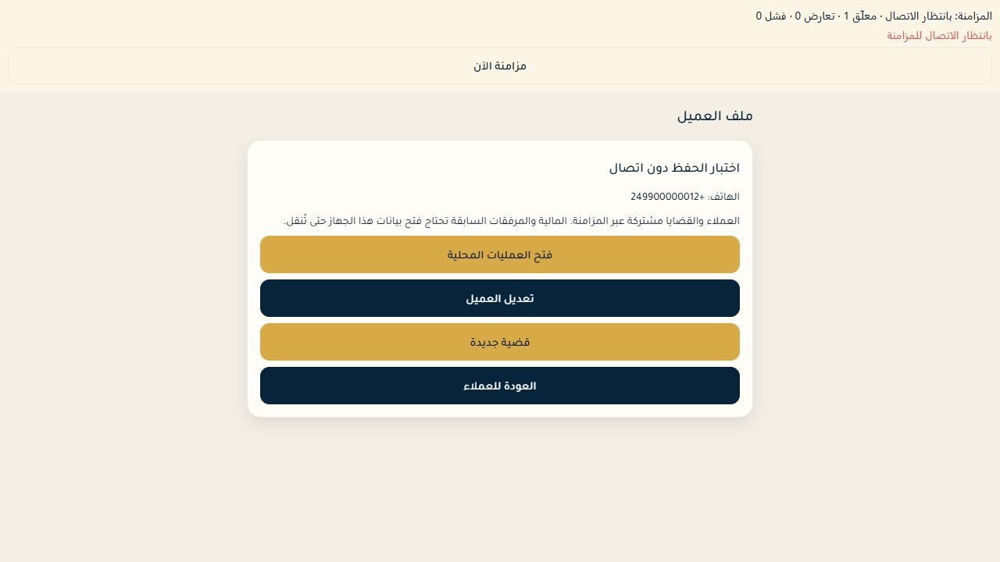
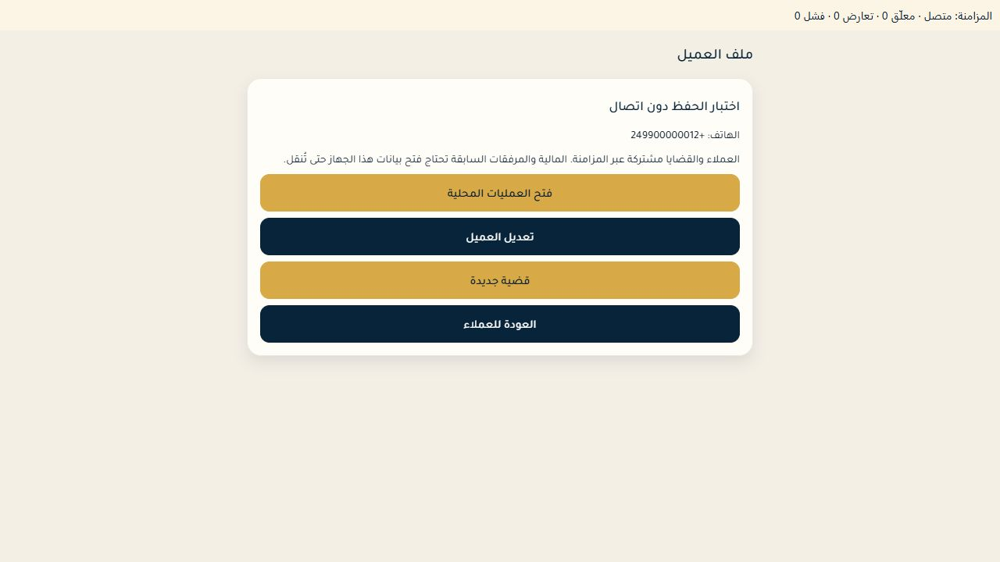

# Foundation verification — 2026-09-30

Implementation evidence and release gates are separated here. All test identities and legal records were synthetic.

## Automated checks
| Check | Result |
|---|---|
| Mobile Vitest, 16 files | 89 passed |
| Domain Vitest, 2 files | 33 passed |
| Mobile TypeScript | Passed |
| Expo lint | Zero errors, five existing import-order warnings in vault.test.ts |
| Expo export --platform all | Android, iOS, Web bundles exported |
| supabase/tests/shared_office_sync.sql | Authenticated roles/RLS passed; fixtures rolled back |
| scripts/verify-shared-api.mjs | Real Auth + HTTP collaboration, isolation, retry/conflict checks passed |

The native store test runs real SQLite via Node 24 with mocked Expo/SecureStore bridges. It verifies ciphertext, partitions and transaction rollback. It does not replace testing Expo's native module on a device.

SQL coverage: two offices; creator stamps; idempotency; stale revisions; foreign-office clients; assignment history/removal; direct assignment-write denial; admin/lawyer/employee/reception roles; suspended/invited membership; suspended admin denied team creation; platform-only legal-data denial; commercial/administrative/real-estate/consultation types; expert parties; retained structured details.

## Browser evidence
A temporary office admin signed in through the normal screen. Authenticated greeting and real shared counts appeared. Cold navigation allowed shared work while the legacy vault remained locked.

Network was disabled for that test tab. A client entered with Arabic phone/identity digits saved locally, appeared in its profile and showed one pending mutation.

Network was restored and “مزامنة الآن” pressed. Pending count became zero. A database query scoped to that temporary office/client confirmed revision 1, normalized Sudanese phone and national-ID type.

The first browser attempt was interrupted and excluded from evidence. The repeat above succeeded. Network simulation was reset, the test user signed out, the tab closed and verification Metro stopped.

## Real HTTP conflict correction
SQL tests originally accepted a 40001-based domain conflict, but the HTTP request hung. [Official Supabase guidance](https://supabase.com/docs/guides/troubleshooting/high-cpu-and-infinite-transaction-retries-when-using-custom-error-codes-in-rpc-functions-77326b) confirms custom 40001 can trigger indefinite PostgREST retries. Revision conflicts now raise PT409; the HTTP probe verified status 409. The follow-up catalog check found no active sync_client retry backends.

The HTTP harness requires six disposable accounts and two isolated offices named TEMP Shared API Verification A/B, provisioned separately. Its manifest has users/phones/password/officeA/officeB and stays outside Git. It uses the mobile publishable key and normal Auth sessions; it cannot do privileged provisioning/cleanup. Never pass real office accounts. This run's manifest was removed.

Cleanup was restricted to the exact generated offices/users and verified synthetic scope. Business deletions retained ordinary triggers/FKs. Only synthetic audit disposal bypassed the immutable trigger inside one privileged transaction; other connections retained protections and normal enforcement resumed before user deletion. Final users/offices/clients/matters counts were zero. No genuine office data was involved.

## Native acceptance still required
1. Open the current Expo runtime on Android/iOS; verify SQLite and SecureStore initialize.
2. Login, create a client/case, assign a colleague, lose connection and restart.
3. Verify drafts/outbox survive restart; reconnect and confirm another device sees them.
4. Verify competing edits retain the draft and require explicit resolution.
5. Verify signout, account switching, lease expiry and known denial block unauthorized local access without deleting encrypted drafts.
6. Open a backed-up legacy vault with its original password; select genuine clients/cases, import twice without duplication, retain workflow/finance/file originals.

## Advisor findings
Existing auth-checked definer endpoints remain flagged: my_access, platform_list_offices, platform_set_office_status, portal_overview. These are deliberate API projections/management entry points; do not remove auth guards or add a tenant bypass. [Advisor reference](https://supabase.com/docs/guides/database/database-linter?lint=0029_authenticated_security_definer_function_executable).

Leaked-password protection remains disabled; it was not silently changed. Track enabling it before public rollout using [Supabase password security guidance](https://supabase.com/docs/guides/auth/password-security#password-strength-and-leaked-password-protection). private.bootstrap_codes intentionally has RLS with no client policy.
