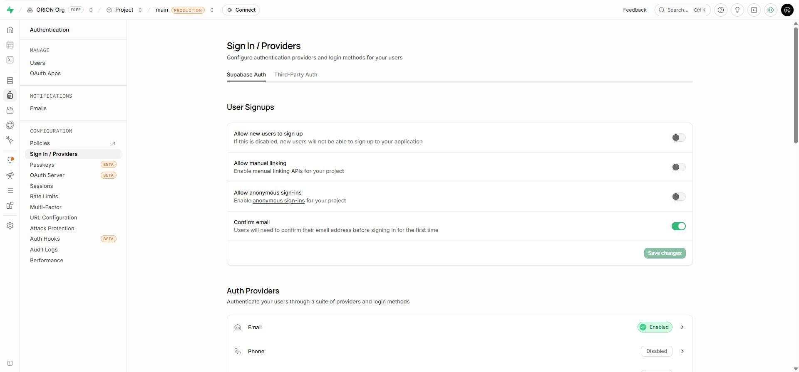

# التقرير النهائي للدمج والإصلاح — 2026-10-01

## النتيجة

تم جمع العمل المحلي غير المحفوظ مع فرعي مسارات القضايا وطلبات المكاتب التجريبية في `codex/integrate-trial-release`، وحل تعارضات الكود والمعمارية والاختبارات. حالة دمج GitHub النهائية موثقة في نهاية هذا التقرير.

**النسخة اجتازت الفحوص البرمجية وقاعدة البيانات والتصدير، لكنها لا تمثل قبولاً نهائياً على الهاتف أو اكتمال رؤية SaaS.** لم يُبن APK ولم يُصدر رابط تنزيل جديد في هذه الجولة. لا تزال المالية والمستندات محلية، وبعض الوحدات تحتاج اتصالاً.

## ما دُمج

| العمل | النتيجة |
|---|---|
| الأساس المحلي السابق | حُفظ في commit `b84d51b` قبل الدمج، مع SQLite/IndexedDB المشفر والمزامنة والعضوية والتعيينات والاستيراد |
| `claude/determined-newton-5a1kyb` | دُمج في `7336f4a`: الجلسات والمراحل والمهل والملاحظات والقوالب والنشاط المشترك |
| `claude/youthful-babbage-5kkk9r` | دُمج في `c18e509`: طلبات المكاتب، الموافقة والرفض، أيقونات التطبيق وإعداد APK التجريبي |
| الإصلاحات الناتجة عن الدمج | استعادة التوافق بين التخزين المحلي والمشترك، تصحيح أنواع البيانات والصلاحيات والمصادقة والبناء |

الفرع يحتوي تاريخ `origin/main` الذي كان عند `75e3c34` وقت بدء التكامل. لم يُحذف أي فرع عمل، ولم تُعد كتابة التاريخ بالقوة.

## الإصلاحات المنفذة

1. **الحفاظ على العمل دون اتصال:** العملاء والقضايا والأطراف والتعيينات بقيت خلف طبقة المزامنة؛ لم تستبدل بمستودعات تتطلب الاتصال لكل عملية. حالة المزامنة والتعارضات ظاهرة.
2. **داشبورد المكتب:** الترحيب باسم الحساب الفعلي، وليس اسماً ثابتاً. العملاء والقضايا من المخزن المشترك؛ الجلسات والمهل والنشاط من الخادم. عند انقطاع الاتصال تظهر حالة عدم التوفر، والمالية موضحة كبيانات محلية أو خزنة مقفلة.
3. **البيانات القديمة:** قراءة نسختي الخزنة 1 و2، الاحتفاظ بالأصل تحت `legacy`، واسترجاع المالية والمستندات عبر روابط القضايا المستوردة والمتحقق منها. المواعيد والملاحظات المحلية القديمة محفوظة في الأصل ولا تُنشر تلقائياً.
4. **عزل الحسابات:** المستودع المحلي مرتبط بجلسة الخزنة. الحفظ المتأخر من حساب سابق يُرفض بعد تبديل الحساب؛ الاختبار يتحقق من بقاء بيانات الحساب التالي دون تغيير.
5. **أرشفة العملاء:** حالة العميل تدخل طابور المزامنة وتصل للخادم وتعود عند القراءة، مع حفظ تكرار العمليات الآمن ومنع الاستقبال من الأرشفة في القاعدة.
6. **توافق البيانات:** عدم تحويل أنواع القضايا التجارية والإدارية والعقارية والاستشارات إلى OTHER، والحفاظ على دور الخبير وعلى تفاصيل القضايا الموجودة.
7. **المصادقة:** تحديد مهلة استعادة الجلسة المحفوظة، الحفاظ على الترخيص المحلي المحدود عند فشل الشبكة، إظهار سبب انتظار/رفض المكتب، وإرسال RPC سجل الدخول فعلياً.
8. **طلبات المكاتب:** منع الحساب المعلق/الموقوف من كتابة سجل دخول؛ عداد لجميع محاولات الطلب الصحيحة حتى الرقم المكرر أو فشل إنشاء Auth؛ التعامل مع JSON غير الصالح؛ تسجيل خطأ تنظيف الحساب عند فشل الربط.
9. **تخفيف كشف الأرقام بالتوقيت:** حد أدنى ثانيتان للرد على طلب المكتب. هذا تخفيف للفارق وليس ضماناً لتوقيت ثابت مع الشبكة والخادم.
10. **البناء والاختبارات:** إصلاح مسار alias في Vitest على Windows؛ إدخال `.env` ومتغيرات Supabase في مفتاح كاش Turbo؛ مسح كاش Metro أثناء build؛ تجاهل ملفات Supabase CLI المؤقتة.
11. **توثيق موحّد:** تحديث README والمعمارية وخارطة الطريق وتسليم المطور ودليل النسخة التجريبية. الرؤية الأصلية لم تتغير.

## ما تغيّر على Supabase فعلياً

- المشروع: `ngckrfvsjggpnaddivyq`.
- تطبيق migration إضافية `20261001095602_trial_integration_guards` بعد اختبارها، فأصبح السجل **26 migration**.
- حذف أربع نسخ migration مكررة من المستودع فقط بعد مقارنة محتواها بالنسخ المعتمدة. لا حذف مقابل في قاعدة البيانات.
- نشر `manage-users` إصدار **8 ACTIVE**. الدالة تسمح بنقطة طلب المكتب العامة، وتتحقق من هوية وصلاحية استدعاءات إدارة الحسابات.
- تعطيل التسجيل العام المباشر **Allow new users to sign up** وحفظ الإعداد من لوحة Supabase.
- حدود الطلبات الناجحة الحالية: 20 معلقاً، 30 يومياً إجمالاً، 3 للمصدر في اليوم. أضيفت حدود لجميع المحاولات: 100 يومياً إجمالاً و10 للمصدر. إذا لم يتوفر عنوان مصدر موثوق يبقى الحد العام؛ لم نثبت ترويسة المصدر عبر طلب جديد فعلي.
- لم تُمس بيانات المكاتب الحقيقية أو تُحذف سجلات قانونية. اختبارات SQL الجديدة على المشروع جرت في transaction وانتهت بـROLLBACK.

## نتائج التحقق

| الفحص | النتيجة والدليل |
|---|---|
| Mobile Vitest | **169 ناجحاً، 27 ملف اختبار** |
| Domain Vitest | **36 ناجحاً، ملفان** |
| الإجمالي | **205 ناجحة** |
| `pnpm typecheck` | ناجح في حزم المشروع الست؛ و`tsc --noEmit` للموبايل ناجح |
| `expo lint` | ناجح؛ صفر أخطاء وصفر تحذيرات lint |
| Deno check للدالة | ناجح باستخدام `--no-config --no-lock --node-modules-dir=none` |
| `expo export --platform all --clear` | نجاح حزم Android وiOS وWeb؛ ليس ملف APK ولا اختبار تشغيل Native |
| قاعدة محلية جديدة | replay لكل 26 migration على PostgreSQL 18 باستخدام `supabase_stub.sql` |
| `phase1_access.sql` | نتائج الصلاحيات والمنع المتوقعة؛ الاختبار ينهي معاملته بالتراجع المقصود |
| `phase2_clients_matters.sql` | 44 فحصاً، failures=0 |
| `sudan_only.sql` | 22 فحصاً، failures=0 |
| `matter_workflow.sql` | failures=0 |
| `shared_office_sync.sql` | PASS، ثم ROLLBACK |
| `office_requests.sql` | 55 فحصاً، failures=0 |
| `trial_integration.sql` | PASS محلياً وعلى المشروع مع ROLLBACK؛ التدقيق والأرشفة والتكرار والصلاحيات وحدود المحاولات |
| واجهة الويب | رابط «اطلب مكتباً تجريبياً» والنموذج ومنع إرسال البيانات الناقصة تعمل |
| الرحلة الفعلية الجديدة كاملة | **لم تُنفذ**؛ مراجعة الموافقة الآلية منعت إنشاء مكتب/حساب اختبار على الإنتاج قبل تشغيل الأمر |
| هاتف فعلي وجهازان | **لم تُنفذ في هذه الجولة** |

الاختبارات السابقة لتعاون الحسابات والمزامنة على HTTP والويب موثقة في [تحقق الأساس بتاريخ 2026-09-30](foundation.md). لا نعدّها دليلاً على اكتمال تجربة طلب المكتب الجديدة.

## الموجود والناقص لكل حساب

| الحساب | الموجود | الناقص |
|---|---|---|
| مالك المنصة | إدارة المكاتب ومديريها، الإيقاف والتفعيل، طلبات المكتب والموافقة والرفض | تقارير تشغيل ومالية شاملة، الخطط والاشتراكات والفوترة والاستخدام والدعم وتفعيل الخدمات |
| مدير المكتب | داشبورد شخصي، فريق وأدوار، عملاء وقضايا وأطراف وتعيينات ومزامنة، جلسات وإجراءات ومهل وملاحظات مشتركة | مالية ومستندات مشتركة، تقارير موثوقة لكل المكتب، offline للوحدات الجديدة، إشعارات كاملة |
| المحامي/الموظف/الاستقبال | توجيه حسب الدور وصلاحيات خادم؛ الاستقبال لبيانات العملاء والتواصل دون القضايا الداخلية | صلاحيات تفصيلية قابلة للتهيئة، قبول عملي كامل متعدد الأجهزة |

## حدود الأمان والجاهزية

- فحص Supabase يعرض خمس ملاحظات لدوال SECURITY DEFINER المقصودة والمحمية بهوية/دور المستدعي. اختبارات SQL تغطي حدود الصلاحيات؛ لا نغيّرها إلى INVOKER دون إعادة تصميم. [تفسير Supabase](https://supabase.com/docs/guides/database/database-linter?lint=0029_authenticated_security_definer_function_executable).
- ثلاث جداول في المخطط private عليها RLS بلا سياسات، وهو منع افتراضي مقصود مع الوصول عبر دوال الخادم الضيقة. [تفسير Supabase](https://supabase.com/docs/guides/database/database-linter?lint=0008_rls_enabled_no_policy).
- حماية كلمات المرور المسربة ما زالت معطلة؛ لوحة المشروع تعرض خطة Free وأن التفعيل يتطلب Pro. لم يُغيّر الاشتراك أو تُدفع رسوم. [توثيق Supabase](https://supabase.com/docs/guides/auth/password-security#password-strength-and-leaked-password-protection).
- المراجعة المستقلة للإصلاحات الحرجة الجديدة تبقى من شروط القبول الإنتاجي وفق سياسة التعاون في المستودع؛ لا يُدّعى أن فحصاً مستقلاً أو اختبار جهاز فعلي اكتمل.
- إعداد EAS لا يحتوي بعد على projectId؛ يلزم ربطه بالمشروع الصحيح وبناء preview APK واختبار SQLite/SecureStore والدخول البارد ووضع الطيران والعودة للاتصال وجهازين. [خطوات الإرسال](../trial-release.md).

## خطوة تحتاج موافقة محددة

لإكمال اختبار الإنتاج من البداية للنهاية: إنشاء مكتب وحساب مؤقتين بعلامة اختبار فريدة، إرسال الطلب مرتين للتحقق من الرد الموحد، التأكد من منع الحساب المعلق، الموافقة على المكتب المحدد، التحقق من العضوية، ثم تنظيف هذين السجلين والبيانات التجريبية التابعة لهما فقط وإزالة ملف كلمة المرور المؤقتة.

**سبب التوقف لهذه الخطوة وحدها:** مراجعة الموافقة الآلية رفضت إنشاء حساب ومكتب فعليين في مشروع Supabase الإنتاجي وحفظ كلمة مرور مؤقتة دون تفويض صريح للاختبار وضمان تنظيفه. لم يُنفذ الأمر ولم نلتف على الرفض. لم تمنع هذه الخطوة بقية الإصلاحات والاختبارات المعزولة.

## نتيجة GitHub النهائية

- **تم الدمج في `main` على GitHub** عبر [طلب الدمج #16](https://github.com/orion3dnan2/Maktabi/pull/16) بتاريخ 2026-10-01، الساعة 13:10 بتوقيت الكويت.
- commit الإصلاحات المختبرة: `e7ad5ee43607d4355bb17778376897e5c408e984`؛ commit الدمج: `c41f694491b55192843a7a7fb88561db4f137602`.
- [طلب مسارات القضايا #15](https://github.com/orion3dnan2/Maktabi/pull/15) أصبح **MERGED** أيضاً لأن تاريخه ضمن الدمج.
- تم تحديث `main` المحلي بطريقة fast-forward دون حذف فروع العمل أو استخدام force push. التوثيق اللاحق يسجل النتيجة ولا يغير الكود المختبر.
- لا توجد نتائج CI برمجية جديدة ندعي نجاحها؛ Supabase Preview كان SKIPPED. الأدلة المذكورة هي الفحوص المحلية وفحوص SQL المحددة أعلاه.
- أُغلقت تبويبات التحقق المؤقتة، وأُوقف Metro وخادم PostgreSQL المؤقت. أكد فحص قراءة فقط أن `disable_signup=true`، وأن ملف الحساب التجريبي المحظور لم يُنشأ.
